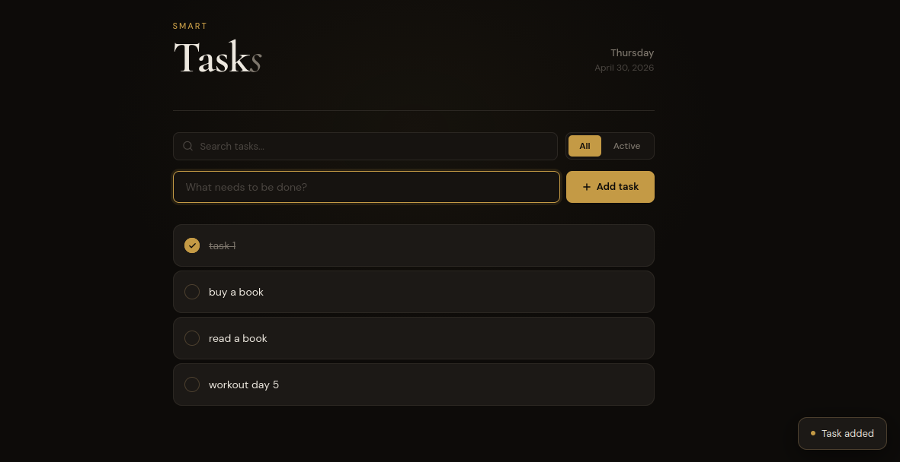
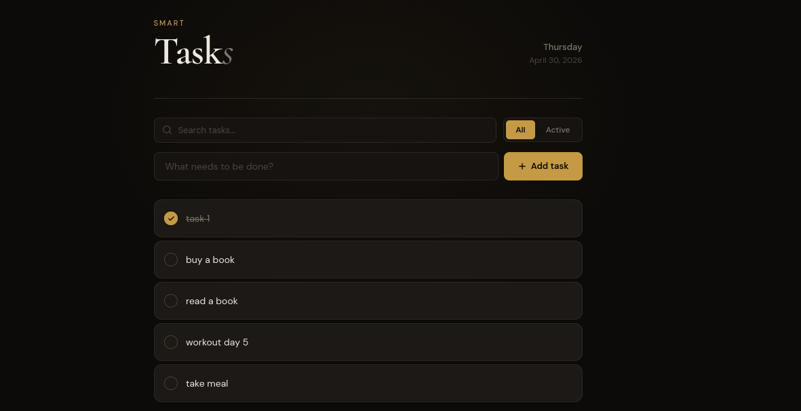
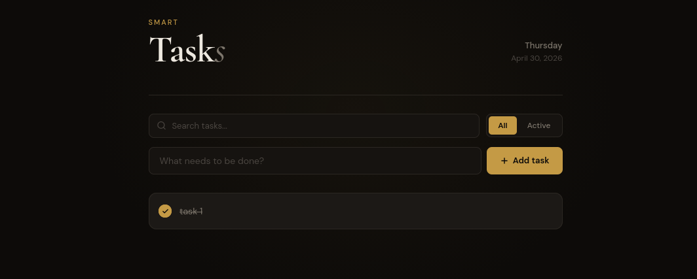
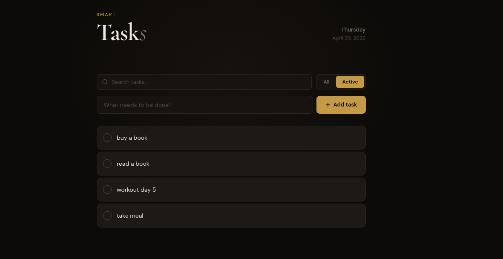
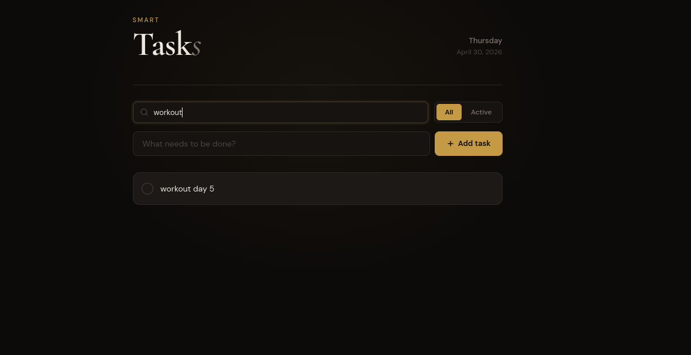
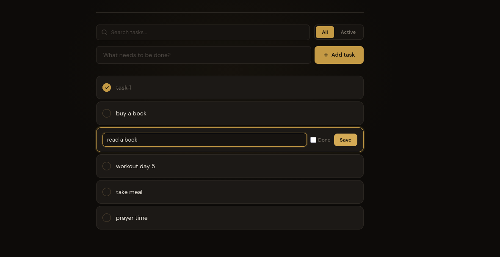
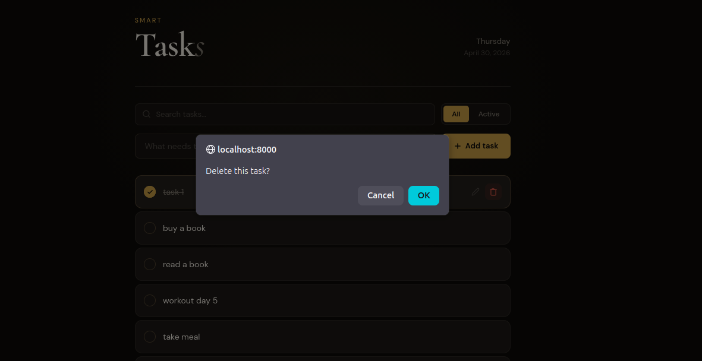

# Smart Tasks

> A minimal, elegant task manager built with Django and HTMX — no JavaScript frameworks, no page reloads.


---

## Overview

Smart Tasks is a clean, dark-themed task management application that demonstrates how to build reactive, SPA-like experiences using **Django** on the backend and **HTMX** for dynamic UI updates — with zero JavaScript framework overhead.

The UI is built entirely with vanilla CSS, using a refined dark palette with gold accents and editorial typography (`Cormorant Garamond` + `DM Sans`).

---

## Features

| Feature | Description |
|---|---|
| **Add Tasks** | Instantly append a new task without a page reload |
| **Complete Tasks** | Toggle completion with an animated checkbox |
| **Edit Tasks** | Inline editing — click the pencil, update, save |
| **Delete Tasks** | Remove tasks with a confirmation prompt |
| **Live Search** | Debounced real-time search (500 ms) across all tasks |
| **Filter View** | Toggle between All and Active tasks |
| **Toast Notifications** | Subtle slide-up toast on task creation |
| **Loading Indicator** | Thin gold progress bar during HTMX requests |
| **Empty State** | Friendly placeholder when no tasks exist |

---

## Tech Stack

```
Backend     Django 6.0  (Python 3.14)
Reactivity  HTMX 1.9    (hypermedia-driven, no JS framework)
Database    SQLite      (zero-config, file-based)
Fonts       Cormorant Garamond · DM Sans  (Google Fonts)
Styling     Vanilla CSS with CSS custom properties
```

---

## Project Structure

```
smart_task_manager/
├── manage.py
├── smart_task_manager/
│   ├── settings.py
│   └── urls.py
└── tasks/
    ├── models.py              # Task model (title, completed)
    ├── views.py               # All view logic
    ├── urls.py                # URL patterns
    └── templates/tasks/
        ├── task_list.html     # Main page
        └── partials/
            ├── task_item.html # Single task card (HTMX partial)
            ├── task_list.html # Task list (search/filter partial)
            └── task_edit.html # Inline edit form (HTMX partial)
```

---

## API Endpoints

| Method | URL | Description |
|---|---|---|
| `GET` | `/` | Render full task list |
| `POST` | `/add/` | Create a task, return HTML partial |
| `GET` | `/edit/<id>/` | Return inline edit form |
| `POST` | `/update/<id>/` | Save edits, return updated task card |
| `DELETE` | `/delete/<id>/` | Delete a task |
| `GET` | `/search/?q=` | Return filtered task list HTML |
| `GET` | `/filter/?status=` | Return `all` or `active` tasks HTML |

---

## Getting Started

**1. Clone the repository**

```bash
git clone https://github.com/your-username/smart-task-manager.git
cd smart-task-manager
```

**2. Create and activate a virtual environment**

```bash
python -m venv venv
source venv/bin/activate        # Windows: venv\Scripts\activate
```

**3. Install dependencies**

```bash
pip install django
```

**4. Apply migrations and run**

```bash
python manage.py migrate
python manage.py runserver
```

**5. Open in browser**

```
http://localhost:8000
```

---

## Design Philosophy

This project intentionally avoids React, Vue, or Alpine.js. All interactivity is handled through **HTMX attributes** directly in HTML — swapping fragments of the page returned by Django views. This keeps the stack simple, the bundle size near zero, and the mental model straightforward:

- The server is the source of truth
- HTML is the API response format
- HTMX handles the DOM diffing and swapping

---

## Screenshots

### Adding a Task
Type a task title and hit **Add task** — the new card slides in instantly with a toast notification, no page reload.



---

### Full Task List
The **All** view shows every task. Completed tasks appear faded with a strikethrough; active tasks remain prominent.



---

### Marking a Task Complete
Click the circle checkbox to toggle completion. The gold checkmark animates in and the card dims.



---

### Filtering Active Tasks
Switch to the **Active** tab to instantly hide completed tasks and focus on what's left.



---

### Live Search
Start typing in the search bar — results update in real time (500 ms debounce) without leaving the page.



---

### Inline Task Editing
Click the pencil icon on any task to open an inline edit form. Update the title or mark it done, then save.



---

### Deleting a Task
Click the trash icon to trigger a browser confirmation before the task is permanently removed.



---

## Author

**Abu Hanif** — [ahanif2500@gmail.com](mailto:ahanif2500@gmail.com)

---

## License

MIT — free to use, modify, and distribute.
